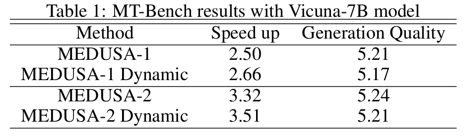

## MEDUSA+: Acceleration Multiple Heads Decoding for LLM via Dynamic Tree Attention

This repository is built at the top of [MEDUSA](https://github.com/FasterDecoding/Medusa).
MEDUSA is a method to accelerate the decoding of large language models (LLMs) by predicting multiple next tokens.
It constructs candidate sequences by combining multiple next tokens with fixed patterns. 
Then it evaluates the candidate sequences in parallel by a customized attention mask which is called tree attention.
This repository improves MEDUSA by introducing a dynamic tree attention mechanism. 
The decoding efficiency is improved in terms of tokens per inference.




### Usage
First install the `MEDUSA` package. The core code is in the `medusa_dynamic.py` file.
```python
import medusa_dynamic
```

In `examples.ipynb`, we provide a complete example to demonstrate how to run the model. We also visualize the dynamic tree structure.

### Benchmark
If you want to generate data for benchmark. You should put `gen_model_answer_medusa_dynamic.py` into the `llm_judge` folder of [MEDUSA](https://github.com/FasterDecoding/Medusa) repository. For more details, please refer to [MEDUSA](https://github.com/FasterDecoding/Medusa).

### Plan
- [ ] Optimize the code to reduce the overhead.
- [ ] Explore better strategies to approximate the joint distribution of sequences. Currently, it is approximated by the Cartesian product of the marginal distributions.

